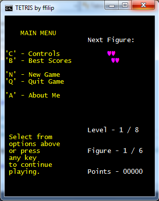
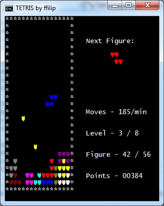

# Tetris
.NET console project based on classic Tetris game

 This application has detailed menu section and simplified, but informative interface.
 
 The graphics is clear, without screen flickering.

Game controls:

        Right Arrow - Right
        Left Arrow - Left
        Down Arrow - To Bottom
        Space - Figure rotation
        
        S - Skip current figure
        M - Game Menu - Pause
        

    
    

        
And... still unfinished -

        there is some more code to be refactored;
        some changes in Score table - e.g. showing your result in case it's not present in Top 10 best scores;
        
