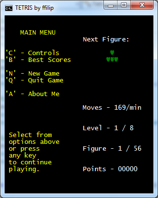

# Tetris
.NET console project based on classic Tetris game.

 This application has detailed menu section and simplified, but informative interface.
 
 The graphics is clear, without screen flickering.

Game controls:

        Right Arrow - Right
        Left Arrow - Left
        Down Arrow - To bottom
        Space - Figure rotation
        
        P - Pause
        S - Skip current figure
        M - Game Menu
        

    
 &nbsp; &nbsp;
    
     
     

<b>
    I have added new features - obstacles after each level and speed label.
</b>
